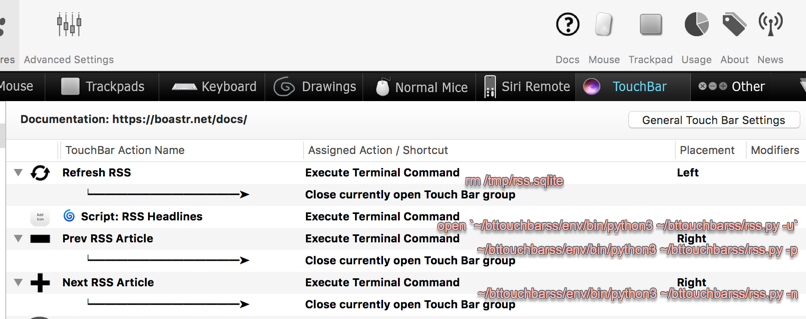

# bttouchbarss
A simple RSS headline fetcher for the MacBook Pro TouchBar and BetterTouchTool

I will add how to configure this in the TouchBar section of the BTT Preferences as soon as I get a chance.

Here is an annotated screenshot:

I did this a while ago, but IIRC, I had to add the `Close currently open Touch Bar group` actions to get things to refresh properly.
